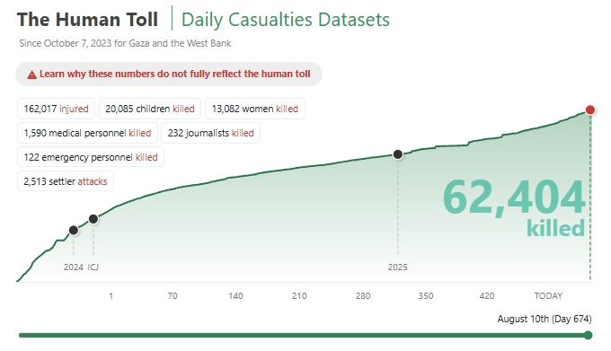

#  Casualties Daily Data Analysis

An **interactive data analysis web app** built with [Streamlit](https://streamlit.io/) and [Plotly](https://plotly.com/python/) for exploring and visualizing **daily casualties data**.

---

##  Features
- **Data Preview** — View the first rows of your dataset.
- **Interactive Visualizations** — Choose:
  - X-axis and Y-axis columns.
  - Plot type: Line, Bar, or Scatter.
- **Summary Statistics** — Get descriptive stats instantly.
- **Data Download** — Export filtered data as CSV.

---

##  Tech Stack
- **Python**
- **[Streamlit](https://streamlit.io/)**
- **[Pandas](https://pandas.pydata.org/)**
- **[Plotly Express](https://plotly.com/python/plotly-express/)**

---

##  Project Files
```
├── app.py               # Main application script
├── casualties_daily.csv # Dataset (place in same directory)
└── README.md            # Project documentation
```

---

##  Running Locally

1. **Clone this repository**:
   ```bash
   git clone https://github.com/yourusername/casualties-data-analysis.git
   cd casualties-data-analysis
   ```

2. **Install dependencies**:
   ```bash
   pip install -r requirements.txt
   ```
   Or manually:
   ```bash
   pip install streamlit pandas plotly
   ```

3. **Run the app**:
   ```bash
   streamlit run app.py
   ```

4. Open the local URL in your browser.

---


## 📷 Example Output


## 📌 Notes
- Ensure `casualties_daily.csv` is in the same folder as `app.py`.
- CSV must be comma-separated.
- Large files may load slower.

---

## 📜 License
This project is licensed under the MIT License - see the [LICENSE](LICENSE) file for details.
